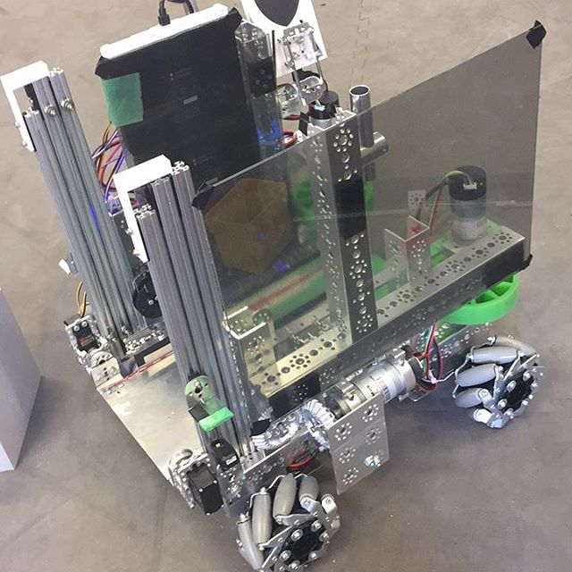
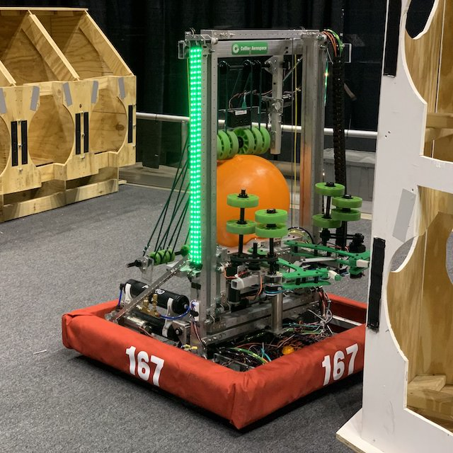

## FIRST and FRC

This section will discuss what FRC is and how it fits into FIRST's set of programs and goals.

### FIRST

FIRST (For the Inspiration and Recognition of Science and Technology) is a global nonprofit organization headquartered in Manchester, NH. According to its website:

> FIRST inspires young people to be science and technology leaders and innovators by engaging them in exciting mentor-based programs that build science, engineering, and technology skills, that inspire innovation, and that foster well-rounded life capabilities including self-confidence, communication, and leadership.

In summary, FIRST promotes STEM education by organizing robotics programs for students of all ages. Their three programs are FIRST LEGO League, FIRST Tech Challenge, and FIRST Robotics Competition.

### FIRST LEGO League

FIRST LEGO League (FLL) is a program for kids from preschool to eighth grade. It is subdivided into three programs: FLL Discover (Pre-K - Grade 1), FLL Explore (Grades 2 - 4), and FLL Challenge (Grades 4 - 8). The first two divisions are simply research and exploration challenges for young students. FLL Challenge is a competition where teams work with LEGO MINDSTORMS kits and block programming to complete various tasks on a tabletop.

### FIRST Tech Challenge

FIRST Tech Challenge (FTC) is a robotics competition for students from grades 7 to 12. Teams consist of up to 15 students. Originally, the program was designed to offer a cheaper alternative to FRC for schools that wanted a robotics program but couldn't afford FRC. However, it has since established itself as a strong and independent program. FTC students design robots to fit in an 18" x 18" cube and program their robots with block programming or Java. Then, they compete against other teams in a 2v2 format. Teams also work to raise money, do outreach events at local schools, and create an engineering notebook.

### FIRST Robotics Competition

FIRST Robotics Competition (FRC) is FIRST's flagship robotics program. It is for students from grades 9 to 12, and adults (e.g. teachers, engineers, etc.) work with students. Team sizes vary—in fact, some teams have nearly 100 students—but most teams have around 30 students. Each team designs and builds a 125 lb robot and programs in Java, C++, or LabVIEW. Then, teams compete in a 3v3 format. FIRST's website reads:

> We call FIRST Robotics Competition the ultimate Sport for the Mind. High-school student participants call it "the hardest fun you’ll ever have." It's as close to real-world engineering as a student can get.

In addition to engineering, FRC teams work year-round to raise funds, do outreach events, and develop a team brand.

### Which program is right for me?

Since FLL doesn't have any overlap with FRC by age range, we will focus on the differences between FRC and FTC. In general, FRC is like FTC but bigger: FRC robots are heavier and more powerful, FRC teams and events are larger, FRC budgets are more expensive, etc. In our school district, there is one FTC team at each high school and one FRC team shared by all the high schools.

Below is a table comparing the FTC and FRC programs in our school district.

|Criterion|FTC|FRC|
|:--------:|:-:|:-:|
|Team(s)|<ul><li style="text-align: left;"><a href="http://rawbacon8743.weebly.com/" target="_blank">Raw Bacon (8743)</a></li><li style="text-align: left;">Lightning Bots (15050)</li><li style="text-align: left;"><a href="https://sites.google.com/view/trobotix/" target="_blank">Trobotix (8696)</a></li></ul>|<a href="https://www.iowacityrobotics.org" target="_blank">Children of the Corn (167)</a>|
|Students Per Team|Up to 15|30+|
|Meeting Location|At school|Kirkwood Regional Center|
|Competition Season|September - February|January - April|
|Robot Dimensions|18" x 18" x 18"|30" x 30" x 84"|
|Robot Weight|30 lbs|125 lbs|
|Programming Language|Java|Java|
|Field Dimensions|12' x 12'|27' x 54'|
|Event Locations|School gyms and hotels|Arenas and convention centers|
|Team Budget|$4,000|$40,000|
|Robot Picture|||
