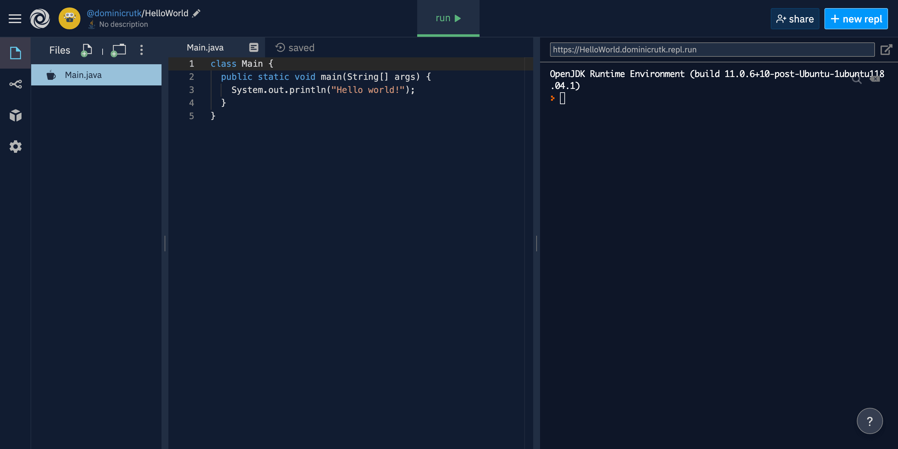

## Hello World

In this lesson, we will go over how to set up Repl.it and use it to write and execute Java programs.

### Why use Repl.it?

Repl.it is an online Java editor (it works with other programming languages too, but we're just using it for Java). As such, it lets you write and run Java programs from any computer. Think of it as Google Docs but for programming in Java. If you read [What is Java?](01-what-is-java.md) (which you should have), then you know that to write and run Java code, you need a JDK installed. Repl.it comes with a JDK built-in, so compiling and executing a Java program is as simple as clicking a button. These features are great for learning because they make getting started incredibly simple. This is why we will use Repl.it in these lessons.

However, rarely do professionals use Repl.it for writing their code. There are a few reasons for this. The first is that Repl.it is slow. When learning, it doesn't feel overly slow, but when writing large applications with lots of files, it slows down, and the small delays add up. Another reason that few professionals use Repl.it is it stores your code on the cloud. This poses a potential security issue for people working on private software or dealing with classified information. The final (and most significant) reason that Repl.it doesn't work for professionals is that it doesn't offer enough flexibility. Professionals need to be able to have complete control over the computers they write their code on. Without going into too much detail, certain types of programming are difficult or impossible using Repl.it. For instance, developing robot code for FRC is not really possible using Repl.it (the chapter on FRC programming explains how to set up another editor).

### A Tour of Repl.it

To get started, go to [repl.it](https://repl.it/) on your computer and click the button in the top right corner to create an account. You can sign in with Google or use your email address.

Each project on Repl.it is called a repl. You will create a new repl for each of the projects in this chapter. Once your account is created, click the button that says "+ new repl" in the top right corner. You should see a few options for your repl. For the language, pick "Java". Be careful as there are several other options with Java in the name including "JavaScript", "Java Swing", and "Java Processing using Processing.js". These options are all incorrect. For the project name, pick whatever makes sense to you. It is important to give your projects meaningful names to keep your code organized in case you need to look back at it. I suggest you name this project "HelloWorld". Assuming you are on the free plan for Repl.it, you must leave your repl accessible to the public, but that won't be a problem.


*A new Java repl called HelloWorld*

Once your repl is created, you should see a screen something like this. There are a few important parts of this interface that you should know about.

At the top is the menu bar. The left of the menu bar lets you navigate back to your profile so you can see all your other repls. The large button in the center labeled "run" compiles and executes your code. Finally, the buttons on the right side of the menu bar let you share your repl with other people or create a new repl.

Looking to the left side of the screen, there is a thin, vertical strip with four icons. The topmost icon shows/hides the files in your repl. The only file that should exist if you just created the repl is `Main.java`. The next two icons are unimportant for this chapter. The last icon contains project settings. You should probably leave them alone except for light/dark mode and font size depending on your personal preferences.

On the left side of the screen after the list of files (which may be hidden), there is a large pane called the editor. This is where you write your code. A new Java repl should start with a little bit of code in `Main.java`. It should look something like this:

```java
class Main {
  public static void main(String[] args) {
    System.out.println("Hello world!");
  }
}
```

On the right side of the screen is a large pane called the console. This is where the results of your program will appear. It is also where you can input data to your program if necessary (e.g. if your program asks for your username, you can type it in the console). If you haven't run a program yet, the console should begin with something like `OpenJDK Runtime Environment (build 11.0.6+10-post-Ubuntu-1ubuntu118.04.1)`. If you have run a program, you can refresh the page, and the console should reset to that text. Taking a look at the text, `OpenJDK` is the type of JDK that is compiling and running your code. The version of Java is 11.0.6 (it might be a higher version for you). As of June 2020, FRC uses Java 11, so everything you learn using Repl.it should be valid FRC code.

When you are ready, you can run the program by clicking the "run" button on the menu bar. After a few seconds, you should see the text `Hello world!` appear in the console (note that there might be a few lines of gibberish before it). Congratulations on running your first bit of Java code! At this point, you can confirm Repl.it is working properly. As a general rule, problems caused by Repl.it can be fixed by refreshing the page.

Take a few minutes to explore the Repl.it interface. Make sure you're comfortable with creating projects, locating existing projects, and running your code. Once you feel ready, you can move on to the next lesson. There, you'll start learning to actually write code!
