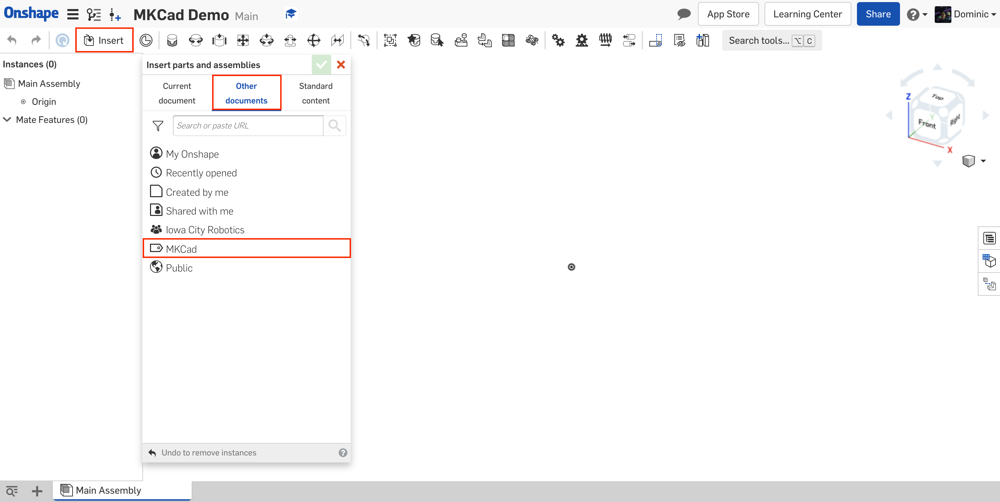

## FRC Setup

After completing all of the [Onshape tutorials](02-onshape-tutorials.md), you are ready to start learning how to use Onshape for FRC. This section will take you through setting up Onshape for FRC by installing relevant part libraries and FeatureScripts.

### Installing MKCad

MKCad is an FRC part library for Onshape. It contains all kinds of useful COTS (Commercial-Off-The-Shelf) parts such as electronics, gearboxes, bearings, etc. Since it is native to Onshape, you can avoid downloading and importing parts from other CAD systems. You can also be certain that colors and materials are set correctly. Most importantly, the library is actively maintained by team 1836 and the rest of the FRC community. Consequently, new products are added quickly.

In Onshape, you do not install a part library like MKCad. Instead, you give it a label to access it easily. To do this, navigate to the "Public" tab within the Onshape file explorer. Then, search for "MKCad - ". Select all the documents owned by "Milkenknights Test Account". Once all the documents are selected, click the label button in the top right corner and create a new label. Call the label "MKCad".

To insert a part from MKCad, click the "Insert" button in the top left corner inside your assembly. Then, choose the "Other documents" option. Clicking the "MKCad" label will reveal each document in the MKCad library. From there, you can locate and insert whatever you desire as you would any other part.

*Instructions for using an MKCad part*

### Installing FRC FeatureScripts

FeatureScript is a programming language specifically for Onshape that allows users to define their own custom features and reuse them. Creating your own FeatureScripts is far beyond the scope of this chapter, but taking advantage of FeatureScripts created by others in the FRC community can save you lots of time.

The most common FRC FeatureScripts are all contained in one document. To install them, click [here](https://cad.onshape.com/documents/95c00401c440b44ad8799ef5/w/1f1ebce01a3b8eb6fa102975/e/763aab7b63ad3c30e7177daa). Then, click the "Custom features" button in the toolbar. Select every item in the list except "Unit Tests". At this point, you will find all the FeatureScripts on the right side of your toolbar whenever you open a part studio.
